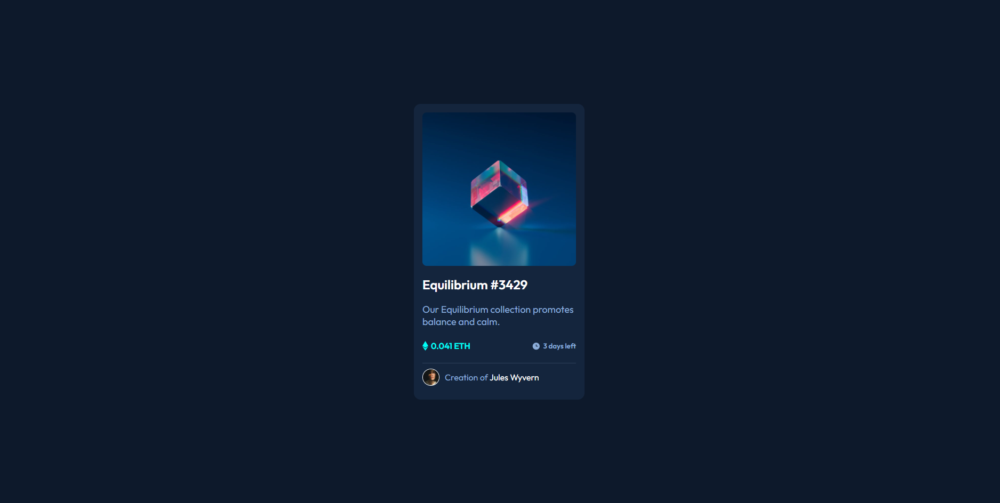
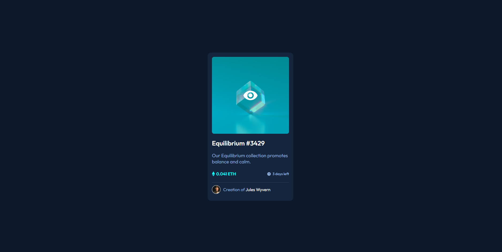
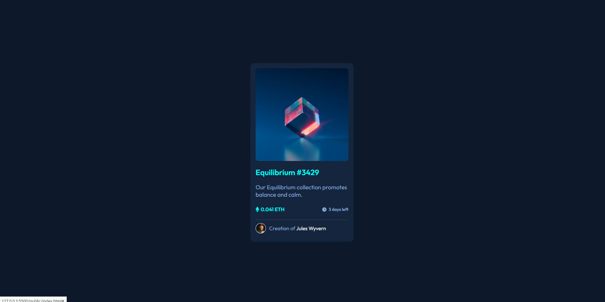
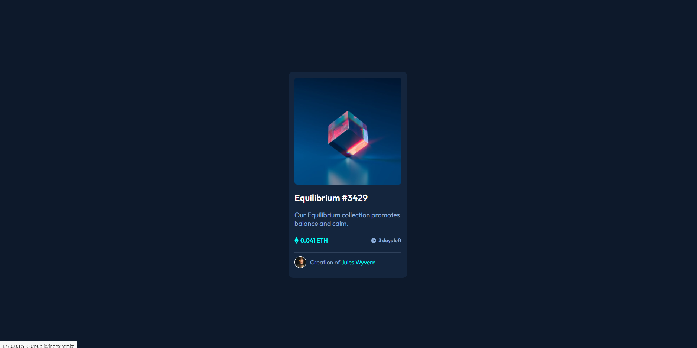
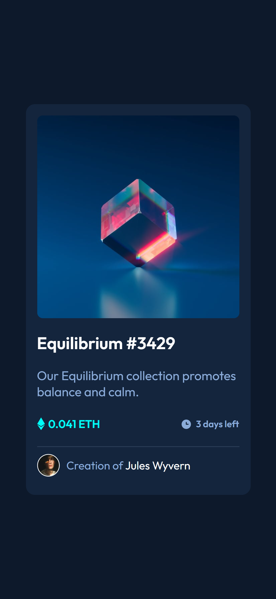

# Frontend Mentor - NFT preview card component solution

This is a solution to the [NFT preview card component challenge on Frontend Mentor](https://www.frontendmentor.io/challenges/nft-preview-card-component-SbdUL_w0U). Frontend Mentor challenges help you improve your coding skills by building realistic projects. 

## Table of contents

- [Overview](#overview)
  - [The challenge](#the-challenge)
  - [Screenshot](#screenshots)
  - [Links](#links)
- [My process](#my-process)
  - [Built with](#built-with)
  - [What I learned](#what-i-learned)
  - [Continued development](#continued-development)
- [Author](#author)

## Overview

### The challenge

Users should be able to:

- View the optimal layout depending on their device's screen size
- See hover states for interactive elements

### Screenshots

#### Normal State

#### Active States

#### Mobile View

### Links

- Live Site URL: [Click here](https://yaikarace.github.io/NFT-Preview-Card-Component/)

## My process

### Built with

- Semantic HTML5 markup
- CSS custom properties
- Flexbox
- CSS position properties
- SASS preprocessor

### What I learned

I learned how to use the position properties of css to be able to overlay 2 images and show one image when the image below is hovered.
I also learned how to use the CSS SASS preprocessor.

### Continued development

I will continue to learn how to use position properties and css flexboxes to be able to make larger projects without any problems.
I will also continue to learn how to use preprocessors like SASS to write CSS code much faster and keep my CSS code clean and tidy.

## Author

- Frontend Mentor - [@YaikaRace](https://www.frontendmentor.io/profile/yaikarace)
- YouTube Channel - [Yaika Race](https://www.youtube.com/c/yaikarace)
- GitHub - [YaikaRace](https://www.github.com/yaikarace)